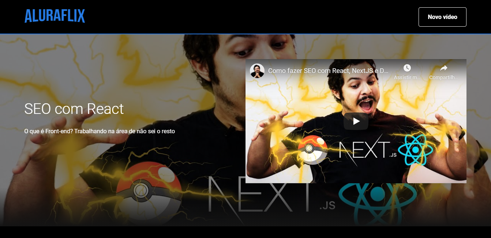
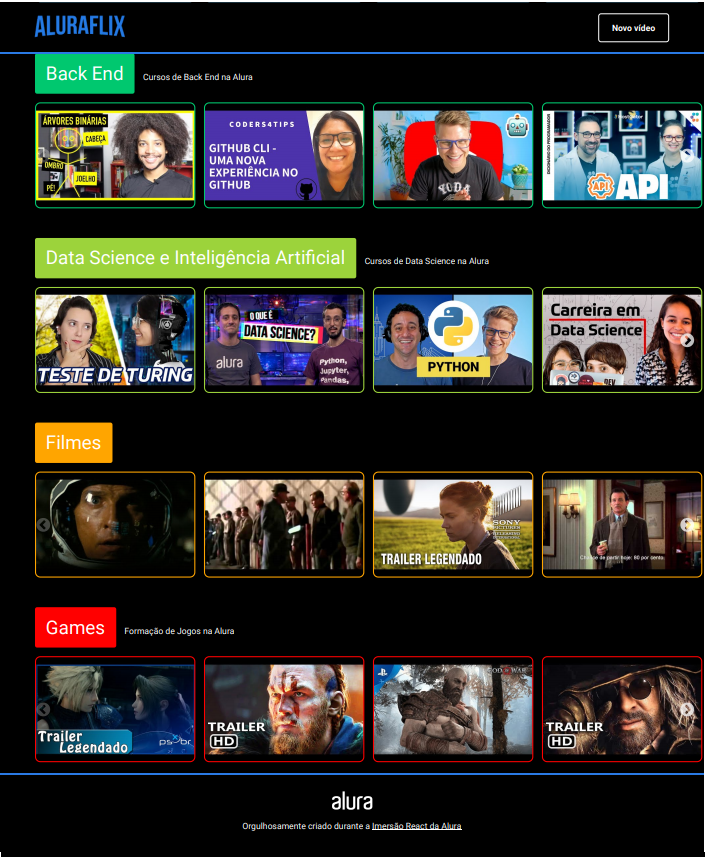

### Esse projeto é um protótipo de uma netflix feita em ReactJS
    
ToDo List:

- [x] Aula 1 - React Components e AluraFlix

- [x] Aula 2 - Roteamento e state

- [x] Aula 3 - Formulários reutilizáveis e mais components

- [x] Aula 4 - Ajax, validação e o back-end

- [x] Aula 5 - Gerenciamento de videos com React e JavaScript

#### Desafio proposto: 
Fazer validações dos formulários e das chamadas à API

#### Abaixo seguem algumas prints de todo o projeto, você pode ver as restantes dentro da pasta screenshots

  |   
|:---------------:|:-----------------:|
