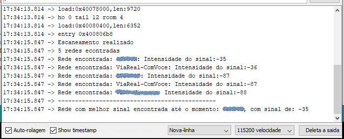

## WiFiNetworkListWithESP32

Projeto criado usando ESP32 para listar o nome e a intensidade do sinal de todas as redes WiFi próximas ao ESP. 

Abaixo segue uma print do serial monitor do Arduino:

 

