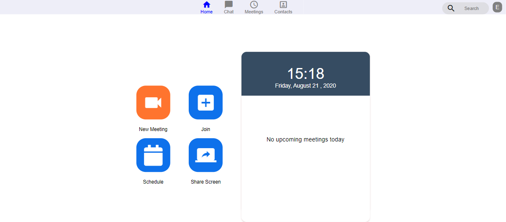

### Clone do zoom

#### Descrição
Projeto desenvolvido na Semana-javascript-expert02. Foi utilizado **javascript**. A proposta do projeto é Clonar o aplicativo Zoom, e suas principais funções.
Mais informações você pode acessar o post no linkedin [ctrl + click](https://www.linkedin.com/feed/update/urn:li:activity:6763189114251550720/)

 

#### Tecnologias
Esse projeto foi desenvolvido utilizando como principal linguagem o **javascript**, utilizando o **PeerJs** para comunicação direta entre os participantes da chamada, além disso, foi utilizado o **Heroku** para a upload do site na web. O projeto final pode ser acessado por esse link: [ctrl + click](https://zoom-clone-w8.herokuapp.com/pages/home/)

  
Tecnologias detalhadas

 - javascript
 - PeerJs
 - Heroku
 - Padrão de projeto Builder

 

## Abaixo seguem algumas fotos de todo o projeto

