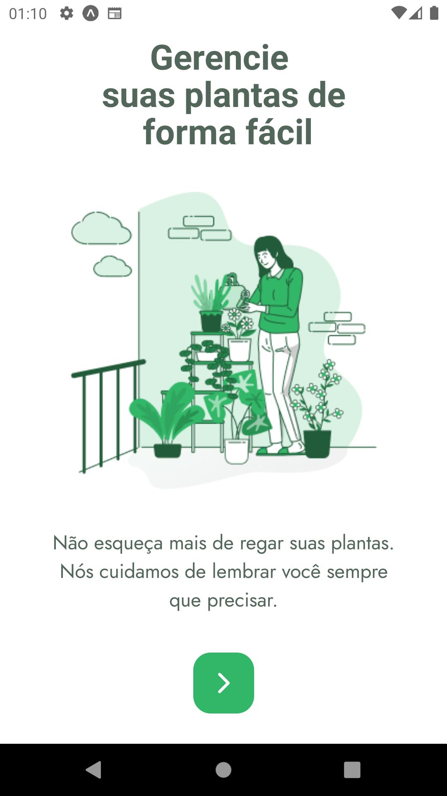
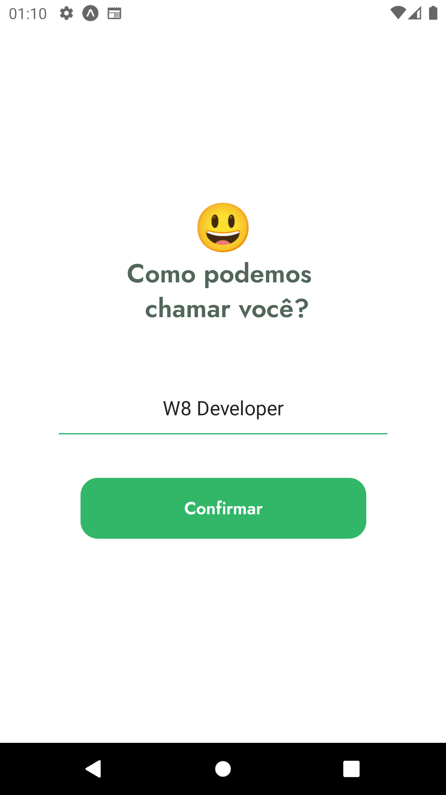
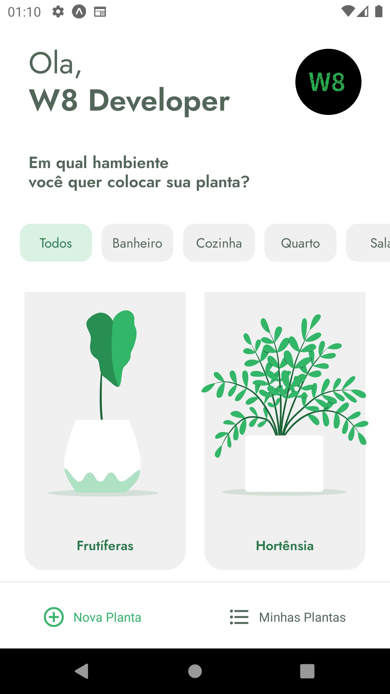
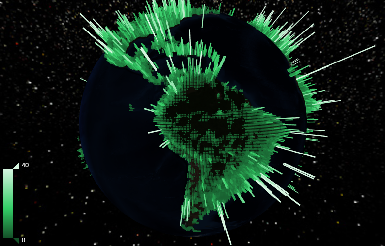
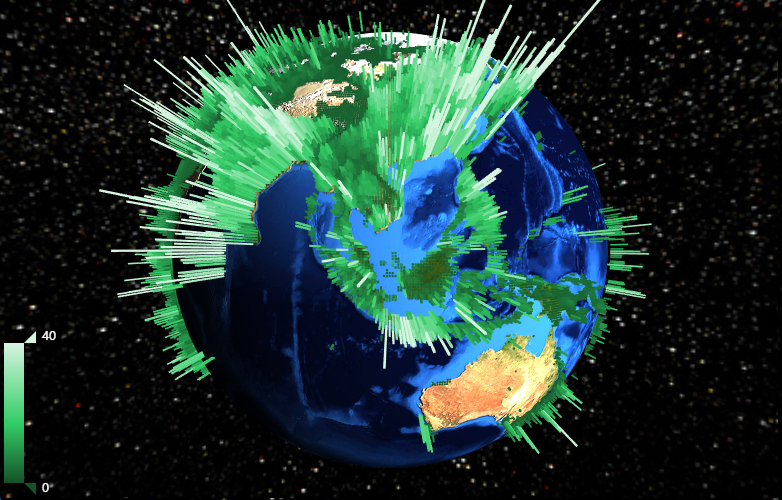
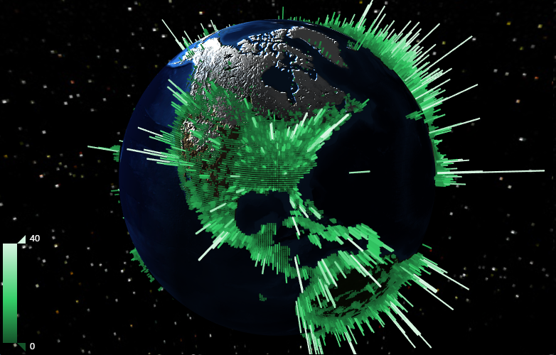
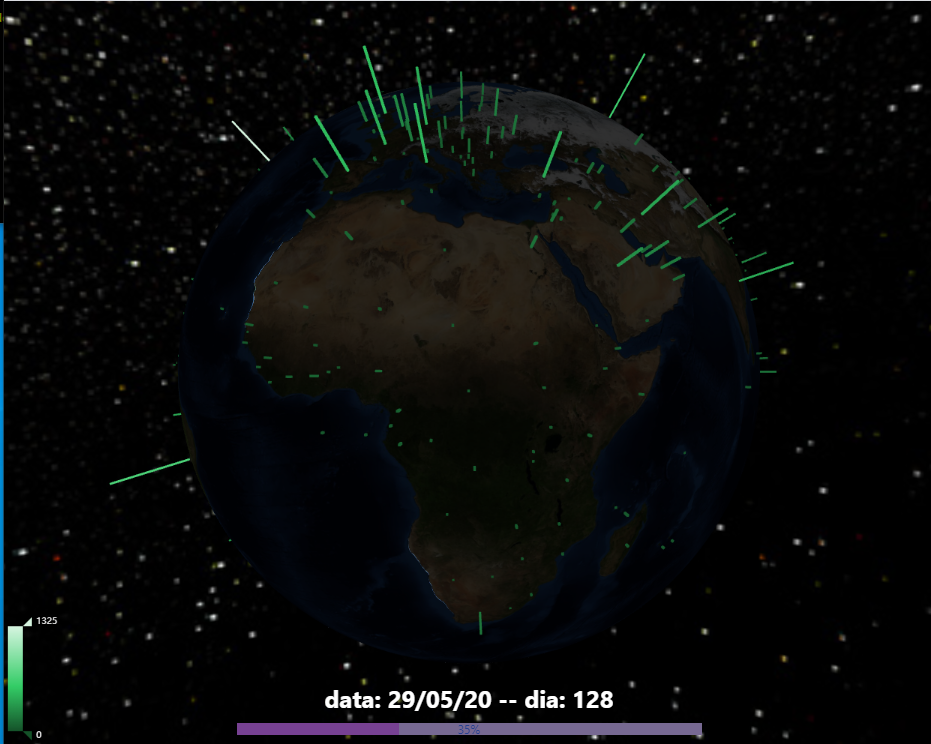
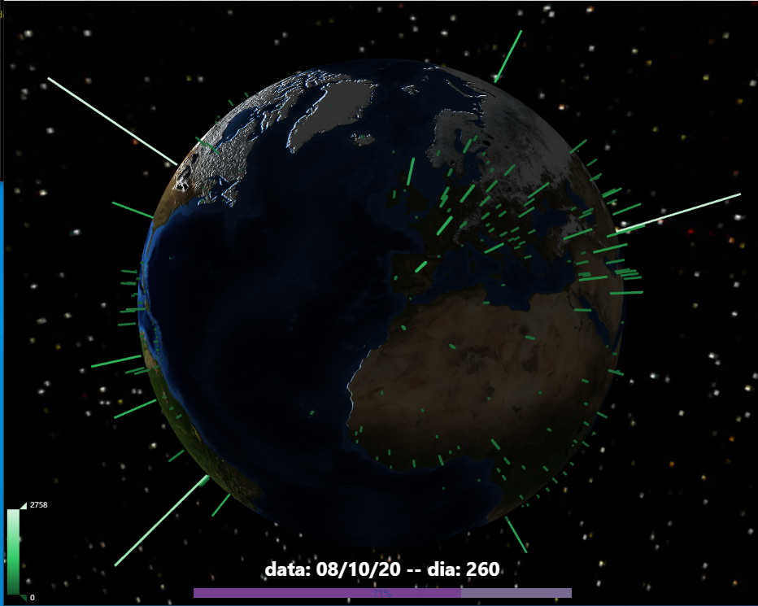
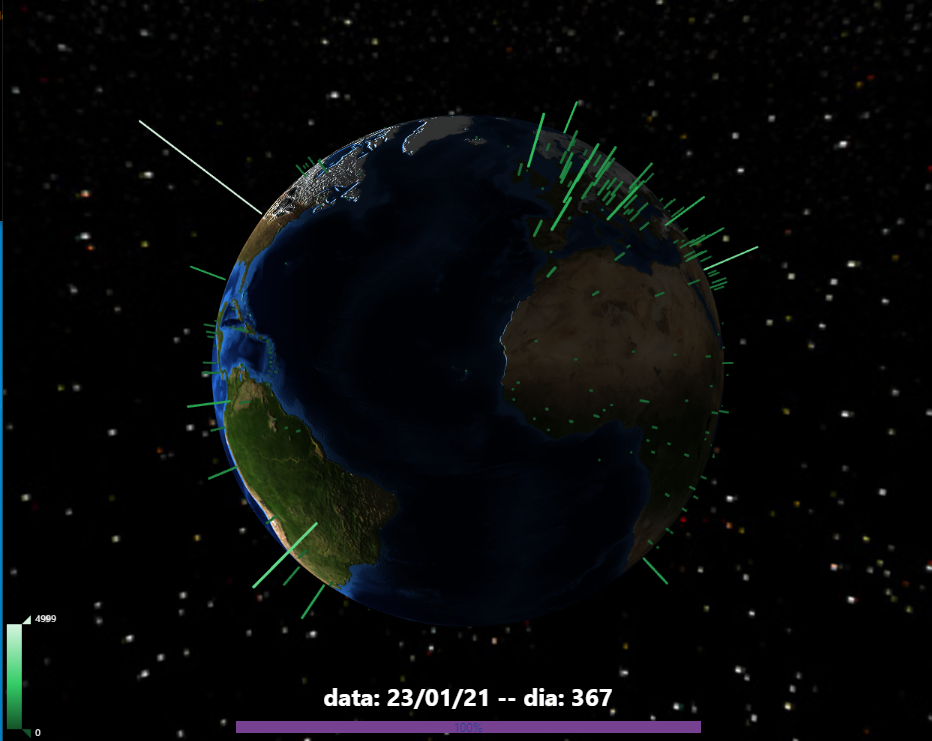

## Seja bem vindo(a)!! 

### Este é meu repositório contendo somente conteúdos relacionados aos meus estudos, projetos desenvolvidos em cursos e afins.

 

  <a href="https://badges.pufler.dev">
    
  </a>
  
  

  

  

  

  

 

Você pode conferir um resumo de todos eles abaixo, e caso tenha interesse em algum deles, você pode clicar no nome do projeto e você será levado para uma nova guia contendo mais imagens e informações sobre o projeto específico.

#### Divirta-se!!! 😀

 

## Projetos em destaque

Lista dos projetos que gostei de desenvolver e gostei do resultado final. Estão apresentados com uma descrição curta e algumas prints. Você pode consultar o projeto completo com toda a descrição e demos clicando no seu nome (ctrl + click para abrir em nova aba).

#### [Ecoleta](https://github.com/W8jonas/estudos/tree/master/nextLevelWeek/Ecoleta)

Projeto desenvolvido na **Next Level Week**, contendo backend, frontend web e aplicação mobile, usando a stack **Node.Js e React**. A proposta do projeto é dar oportunidades para empresas de reciclagem poderem registrar pontos de coletas de resíduos e para que as pessoas tenham visualização para esses pontos marcados.

  |   |    | 
:---------------:|:----------------:|:-----------------:|

#### [PlantManager](https://github.com/W8jonas/estudos/tree/master/nextLevelWeek/plantmanager)

Projeto desenvolvido na **Next Level Week**. É uma aplicação mobile completa, utilizando a stack **React-Native**. A proposta do projeto é lhe ajudar a cuidar melhor de suas plantinhas. O aplicativo fornece várias plantas como opção para serem cadastradas num sistema de push-notifications que lhe avisa quando é o dia e momento para regar sua planta. Para o sistema de notificações funcionar, ele consulta uma API fake contendo o banco de dados com todas as plantas do projeto, onde constam as demais descrições de cada planta.  

  |   |    | 
:---------------:|:----------------:|:-----------------:|

#### [Chart Corona Virus](https://github.com/W8jonas/estudos/tree/master/chartcoronavirus/web)

Globo terrestre em 3D que possibilita ver o total de casos confirmados de coronavirus ao redor do mundo de forma interativa. Foi utilizado ReactJs e a lib Echarts para a plotagem do gráfico.

  |   |    | 
:---------------:|:----------------:|:-----------------:|
  |   |    | 

#### [Comunicação ESP32 para ESP8266 usando socket](https://github.com/W8jonas/estudos/tree/master/Eletronics%2C%20ESP%2C%20Arduino%20and%20IOT/ComunicationWithSocket_ESP32_to_ESP8266)

Esse projeto trata de um sistema de comunicação WiFi Client (ESP8266) to Server (ESP32). O server cria e estabelece um localhost para que o Client consiga se conectar e, a partir disto, enviar dados para o servidor.

  |   | 
:---------------:|:----------------:|

 

## Índice para cada projeto completo

 - Alura
    - [Imersão React - AluraFlix](https://github.com/W8jonas/estudos/tree/master/Alura/imersaoReact/aluraflix)
    - [Imersão Dados - Trabalhando com Data science](https://github.com/W8jonas/estudos/tree/master/Alura/imersaoDados02)
    - [Imersão ReactNext - eletronicaquiz](https://github.com/W8jonas/estudos/tree/master/Alura/imersaoReactNextJs/eletronicaquiz)

 - [NextLevelWeek](https://github.com/W8jonas/estudos/tree/master/nextLevelWeek)
    - [Ecoleta](https://github.com/W8jonas/estudos/tree/master/nextLevelWeek/Ecoleta)
    - [Proffy](https://github.com/W8jonas/estudos/tree/master/nextLevelWeek/Proffy)
    - [Happy](https://github.com/W8jonas/estudos/tree/master/nextLevelWeek/Happy)
    - [plantmanager](https://github.com/W8jonas/estudos/tree/master/nextLevelWeek/plantmanager)

 - [SemanaOmniStack](https://github.com/W8jonas/estudos/tree/master/semanaOmniStack)
    - [Semana 11 - Be The Hero](https://github.com/W8jonas/estudos/tree/master/semanaOmniStack/semana11)

 - [Chartcoronavirus](https://github.com/W8jonas/estudos/tree/master/chartcoronavirus/web)

 - [Rocketpay](https://github.com/W8jonas/estudos/tree/master/rocketpay)

 - [NodeJs SVG Charts](https://github.com/W8jonas/estudos/tree/master/nodeJsCharts)

 - [Imersão data science](https://github.com/W8jonas/estudos/tree/master/dataScience)

 - [Erick Wendel - cloneZoom](https://github.com/W8jonas/estudos/tree/master/Erick%20Wendel/cloneZoom)

 - [arquitetura e padrões de projetos - App de todo](https://github.com/W8jonas/estudos/tree/master/arquitetura_e_padroes_de_projetos/todoApp)

 - Eletronics, ESP, Arduino and IOT
    - [WiFiNetworkListWithESP32](https://github.com/W8jonas/estudos/tree/master/Eletronics%2C%20ESP%2C%20Arduino%20and%20IOT/WiFiNetworkListWithESP32)
    - [CommunicationWithSocket_ESP32_to_ESP8266](https://github.com/W8jonas/estudos/tree/master/Eletronics%2C%20ESP%2C%20Arduino%20and%20IOT/ComunicationWithSocket_ESP32_to_ESP8266)
    - [studyingPointersToCommunication](https://github.com/W8jonas/estudos/tree/master/Eletronics%2C%20ESP%2C%20Arduino%20and%20IOT/studyingPointersToCommunication)

 - ESP32 Bluetooth communication to React-Native APP
    - [Aplicativo](https://github.com/W8jonas/estudos/tree/master/ESP32BLE_to_RN_APP/mobile)
    - [ESP32ServerBLE](https://github.com/W8jonas/estudos/tree/master/ESP32BLE_to_RN_APP/ESP32ServerBLE)
