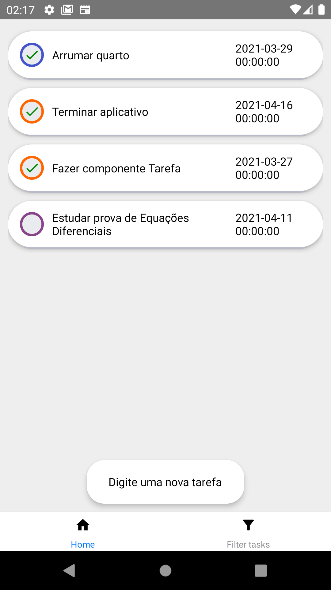
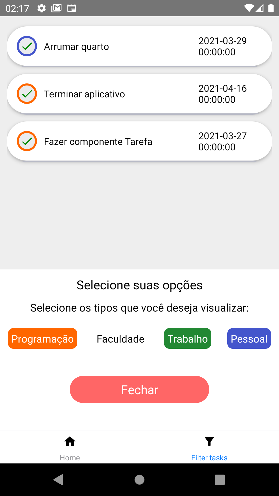
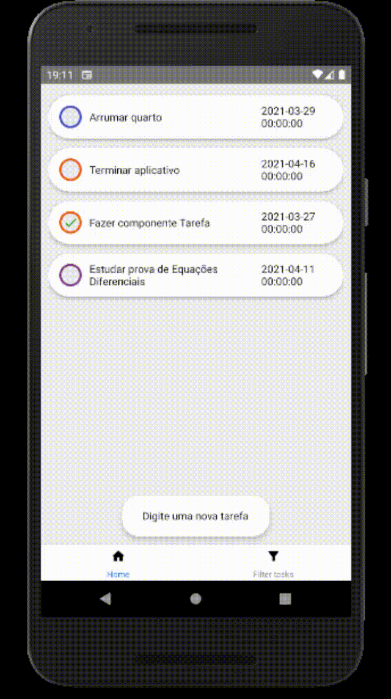
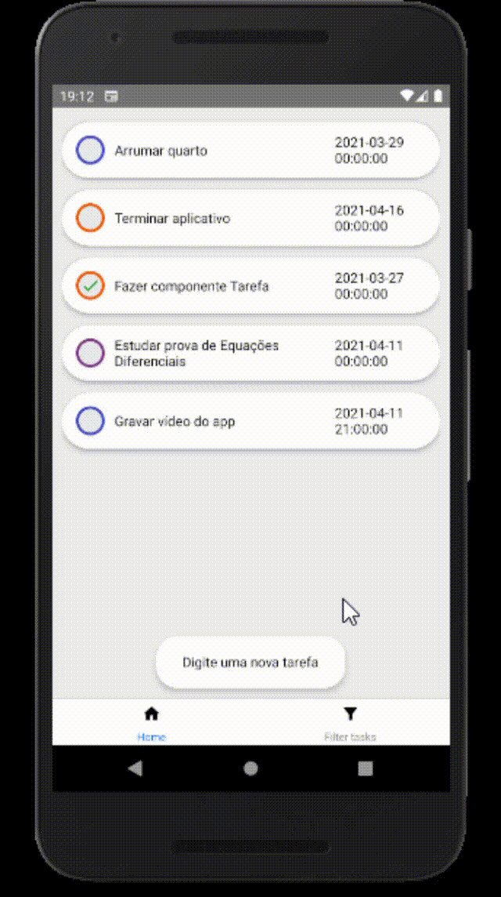

### todoApp - Custom Hooks

#### Descrição
Projeto criado para desenvolver minhas habilidades sobre Animações, User Experience, Custom Hooks e padrões de projetos. A ideia é desenvolver o aplicativo com a arquitetura volta para Custom Hooks, sendo que a dinâmica do aplicativo deve ser toda desacoplada das suas funções, permitindo assim, que toda a parte lógica seja refeita de outra forma. 
Além disso as animações são voltadas para garantir uma melhor experiência de usuário e usabilidade do aplicativo.

Link para o post completo com mais informações no LinkedIn [ctrl + click](https://www.linkedin.com/feed/update/urn:li:activity:6785647557260414976/) 

### Prints do projeto no final do readme

#### To-Do:
- [x] Adicionar ESLint ao projeto
- [x] Criar sistema de rotas da aplicação
- [x] Criar páginas do app:
    - [x] Página: Home
    - [x] Página: FilterTasks
- [x] Criar componentes do app
    - [x] componente Task
    - [x] componente Add Task
        - [x] datePicker
        - [x] Type of task select
    - [x] componente Modal Filter
- [x] Desenvolver parte lógica de tasks do app (CRUD)
    - [x] Adicionar tarefas
    - [x] Marcar tarefa concluída
    - [x] Deletar tarefa
    - [x] Modificar tarefa
    - [x] Filtrar tarefas

- [ ] Desenvolver a documentação

#### Anotações extras:
Cada Tarefa terá as seguintes propriedades:
id: Número de identificação da tarefa - String
Descrição: Campo de texto - String
Data: Data selecionada pelo usuário - Number (Timestamp)
Tipo de tarefa: Tipo da tarefa - String
Feita: Marcador de tarefa realizada - Booleano

#### Documentação:
###### Componente Task
| Parâmetro | Obrigatório | Tipos aceitos | Valor default | Valores aceitos |
| --------- | ----------- | ------------- | ------------- | --------------- |
| id        | Sim         | Number        | Math.random() | Number          |
| description | Sim       | String        | --            | String          |
| date      | Sim         | Number        | new Date().getTime() | Timestamp number |
| type      | Sim         | String        | 'Pessoal' | 'Pessoal','Programação', 'Faculdade', 'Trabalho',  |
| done        | Sim         | Boolean        | false | false, true          |

 

#### Referências:
Referência que usei para layout do projeto:
Autor: Jakub Antalik - Product Designer jakubantalik.com
Link para referência direta: https://dribbble.com/shots/14568765-Dona-mobile-composer-interactions 

## Abaixo seguem algumas fotos de todo o projeto

  |   |
:---------------:|:----------------:|

 

## Abaixo seguem algumas Gifs do app

  |   |
:---------------:|:----------------:|

