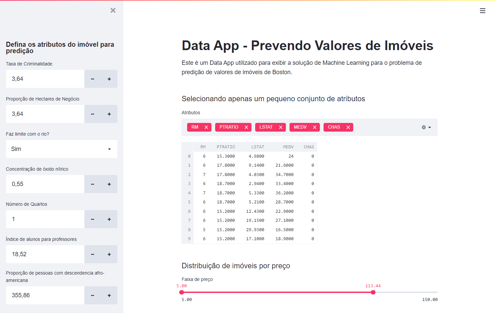
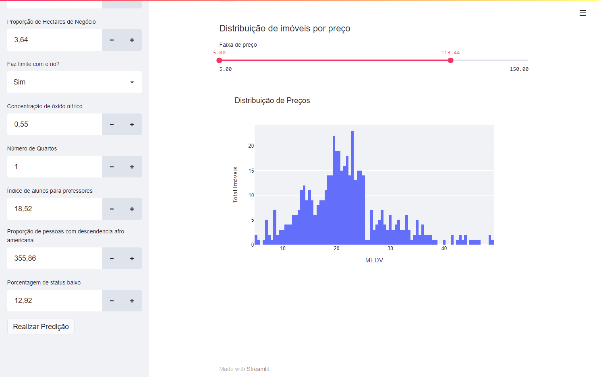

### Prevendo valores de imóveis usando Machine Learning

#### Descrição
Projeto de DataScience desenvolvido durante a semana de data science. O objetivo é aprender o básico de estatística e machine learning analisando um banco de dados sobre preço de casas em Boston e construíndo um algorítmo preditivo

 

#### Tecnologias
Esse projeto foi desenvolvido utilizando como principal linguagem o **python**, usando os pacotes **pandas**, **streamlit**, **plotly**, além disso, foi utilizada a lib **sklearn** para a criação de modelos de aprendizagem de máquina. O projeto foi feito no **Jupyter Notebook** para facilitar a apresentação do código posteriormente. 

  
Tecnologias detalhadas

 - python
 - Jupyter Notebook
 - pandas
 - seaborn
 - numpy
 - matplotlib
 - streamlit
 - plotly
 - sklearn

 

## Abaixo seguem algumas fotos de todo o projeto

  |   |
:---------------:|:----------------:|
