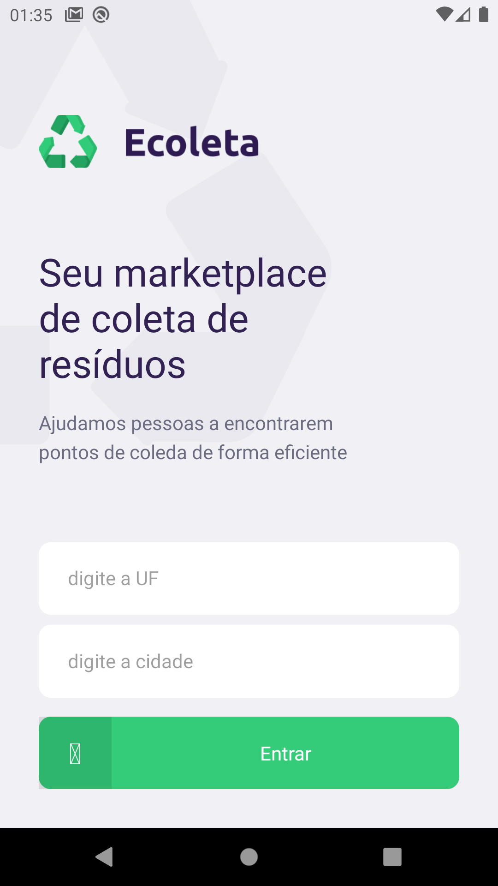
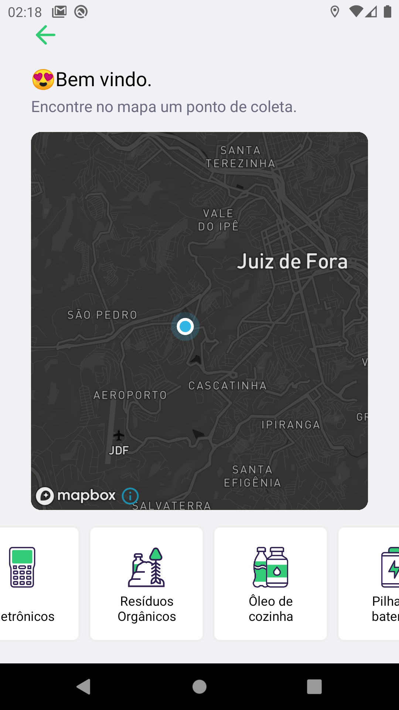
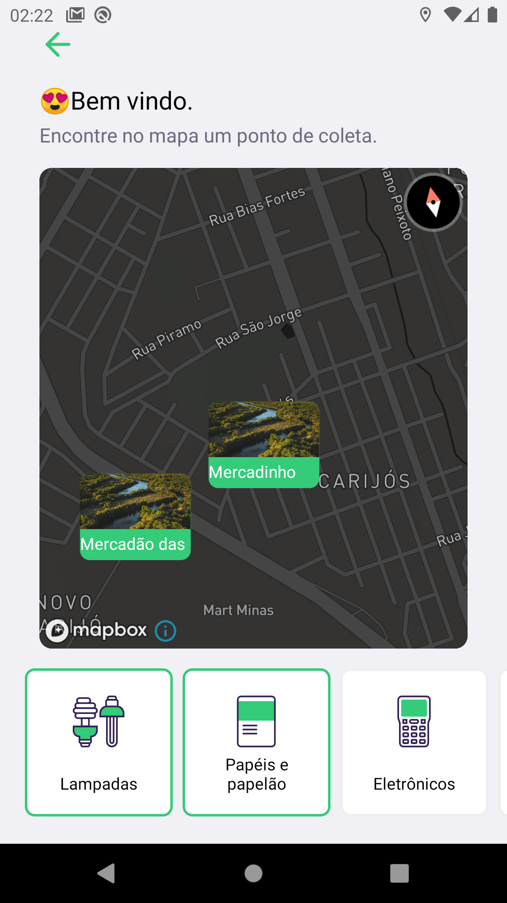
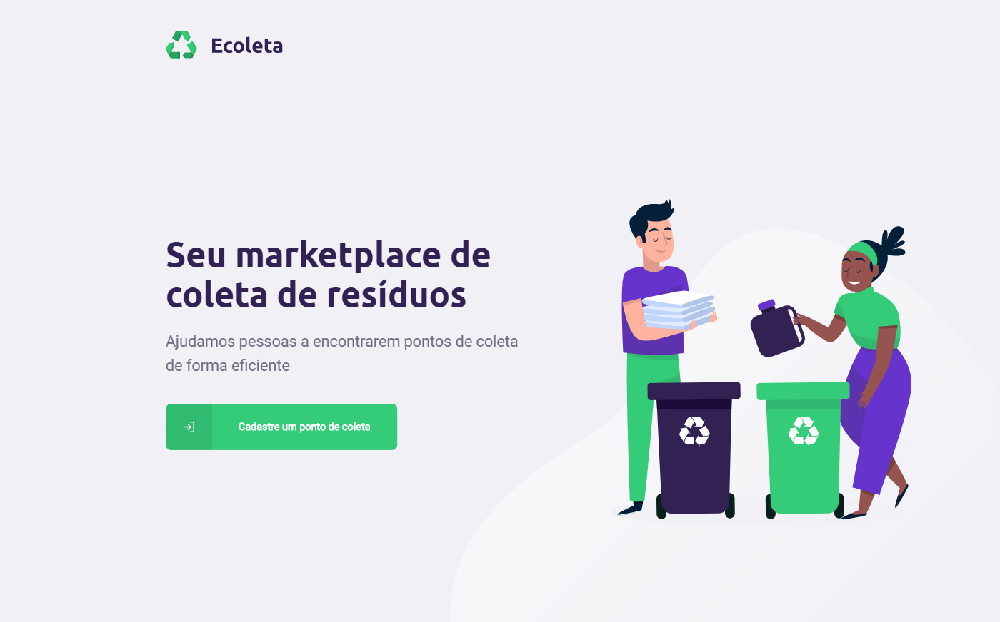
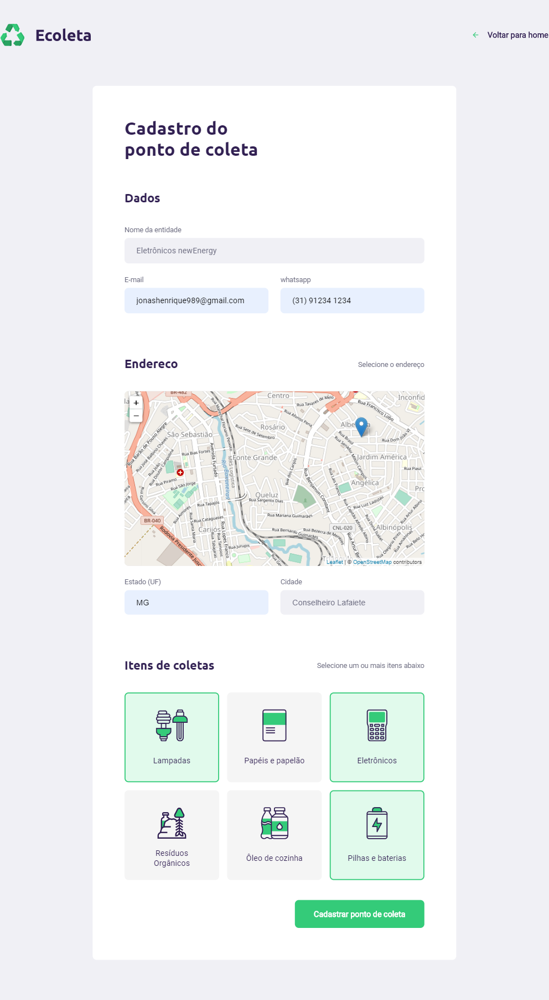

<h1 align="center">
    
     
    ♻️ Ecoleta ♻️
</h1>

<h3 align="center">
    Seu mercado de coleta de resíduos recicláveis
</h3>

 

## Descrição
Projeto desenvolvido na **Next Level Week**, contendo backend, frontend web e aplicação mobile, usando a stack **Node.Js e React**. A proposta do projeto é dar oportunidades para empresas de reciclagem poderem registrar pontos de coletas de resíduos e para que as pessoas tenham visualização para esses pontos marcados.

## Abaixo seguem algumas prints de todo o projeto

### Mobile:

  |   |    | 
:---------------:|:----------------:|:-----------------:|

### Web:

 |    | 
|:----------------:|:-----------------:|

 

## Tecnologias
Esse projeto foi desenvolvido utilizando como principal linguagem o **Typescript**, usando os frameworks o **ReactJs** e **React-Native**, além de **Node** no backend.

  
Backend

 - Node.js
 - Knex
 - Typescript
 - sqlite3
 - Express
 - Cors
 - Celebrate
 - TS-Node
 - TS-Node-Dev

  
Frontend

  
 - Typescript
 - Axios
 - Leaflet
 - React DOM
 - React Icons
 - React Leaflet
 - React Router Dom
 - Styled Components

  
Mobile

 - Typescript
 - Axios
 - mapbox-gl
 - masked-view
 - Geo Location
 - Mail Composer
 - React Native
 - react native vector icons
 - React Native Svg
 - React Navigation
 - Styled Components

