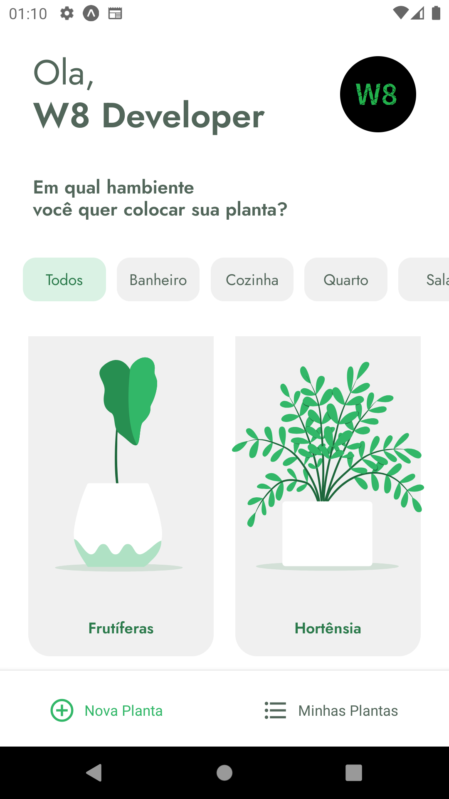
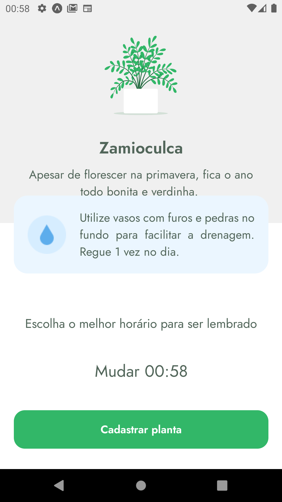
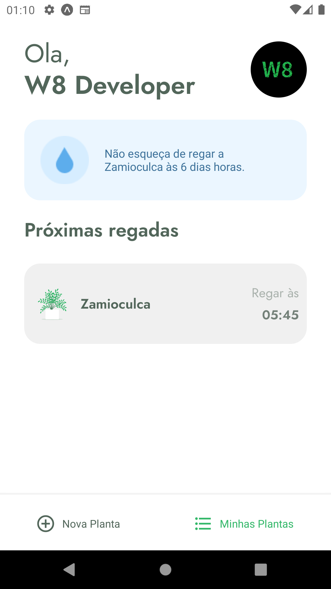
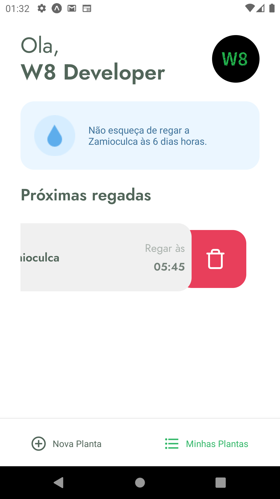

<h1 align="center">
    
     
    🌱 PlantManager 🌱
</h1>

<h3 align="center">
    Seu aplicativo para lhe ajudar a cuidar de suas plantinhas.
</h3>

 

## Descrição
Projeto desenvolvido na **Next Level Week**. É uma aplicação mobile completa, utilizando a stack **React-Native**. A proposta do projeto é lhe ajudar a cuidar melhor de suas plantinhas. O aplicativo fornece várias plantas como opção para serem cadastradas num sistema de push-notifications que lhe avisa quando é o dia e momento para regar sua planta. Para o sistema de notificações funcionar, ele consulta uma API fake contendo o banco de dados com todas as plantas do projeto, onde constam as demais descrições de cada planta.  

## Tecnologias
Esse projeto foi desenvolvido utilizando como principal linguagem o **Typescript**, usando os frameworks o **React-Native**, na plataforma **Expo** e algumas libs extras, como vector-icons e notifications.

  
Tecnologias detalhadas

  - TypeScript
  - Expo
  - Expo-notifications
  - Expo-vector-icons
  - async-storage
  - ESlint
  - Datetimepicker
  - React-navigation
  - React-native-svg
  - Reanimated
  - Lottie
  - Date-fns

 

## Etapas desenvolvidas:
- [x] server
- [x] web
- [x] mobile
- [x] funcionalidade avançadas

 

## Abaixo seguem algumas prints de todo o projeto

  |   |    |
|:---------------:|:----------------:|:-----------------:|
  |   |    |

