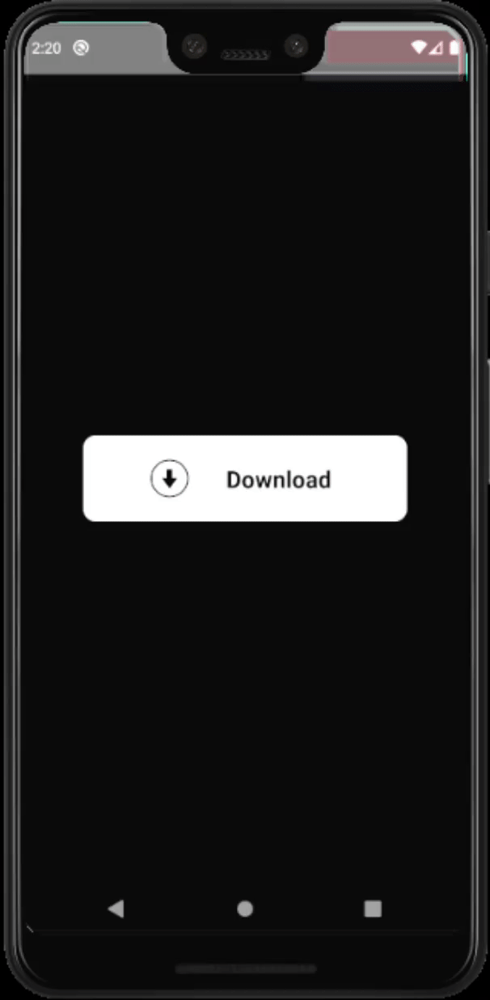

### React-Native Components Animations

  <a href="https://badges.pufler.dev">
    
  </a>

#### Descrição
Olá pessoal! Este repositório contem vários componentes individuais criados por mim contendo animações nativas do React-Native. Incluindo transições, efeitos, transformações e muitos outros. Todas são gratuitas e livres.

Mais informações sobre o projeto podem ser encontradas nesse post no LinkedIn: [ctrl + click](https://www.linkedin.com/feed/update/urn:li:activity:6789932111492210689/)

 

#### Tecnologias
Esse projeto foi desenvolvido utilizando como principal linguagem o **javascript**, usando o framework **React-Native**, além disso, foi utilizada a lib **Animated** para a criação das animações a **Lottie** para animações no formato Lottie.

  
Tecnologias detalhadas

 - React-Native
 - javascript
 - Animated
 - Lottie
 - eslint

 

## Abaixo segue algumas gifs com todos os componentes

